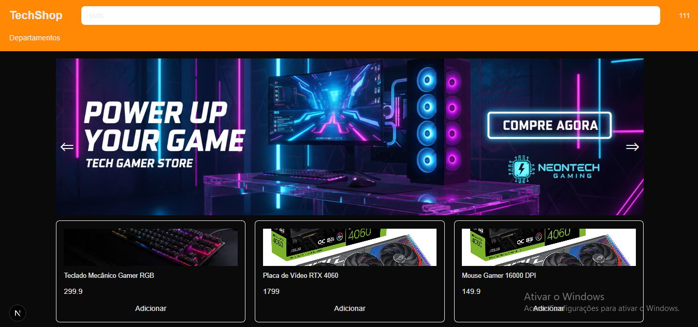

## Getting Started

First, run the development server:

🛒 E-commerce com Next.js e Tailwind CSS

Este repositório contém um projeto de e-commerce moderno, desenvolvido com Next.js e Tailwind CSS, com foco em performance, escalabilidade e experiência do usuário.

O projeto apresenta uma interface limpa e responsiva, conforme demonstrado no screenshot do sistema, utilizando boas práticas de UI/UX, componentização e organização de código.

🚀 Tecnologias Utilizadas

Next.js — Framework React para aplicações modernas e performáticas

React — Componentização e gerenciamento de estado

Tailwind CSS — Estilização utilitária, rápida e altamente customizável

JavaScript / TypeScript (se aplicável)

API REST (integração preparada para backend)

🎨 Interface e UX

Layout responsivo (desktop e mobile)

Design limpo e organizado

Componentes reutilizáveis

Hierarquia visual clara

Foco em usabilidade e conversão

O screenshot do projeto demonstra a estrutura visual do e-commerce, incluindo organização de produtos, navegação intuitiva e identidade visual consistente.

⚙️ Funcionalidades

Listagem de produtos

Página de detalhes do produto

Navegação otimizada

Estrutura pronta para carrinho de compras

Base preparada para integrações futuras (pagamentos, autenticação, etc.)

📈 Performance e SEO

Renderização otimizada com SSR/SSG

Melhor indexação para mecanismos de busca

Carregamento rápido de páginas

Estrutura semântica otimizada